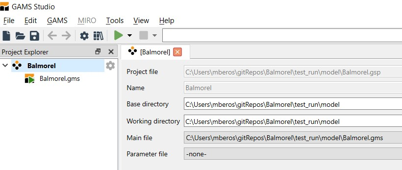

# Running Balmorel

To setup Balmorel in GAMS Studio, you can drag and drop the Balmorel.gms into GAMS Studio to create a correctly setup project. It is important to ensure that the working directory is in Balmorel/test_run/model, as illustrated below:

